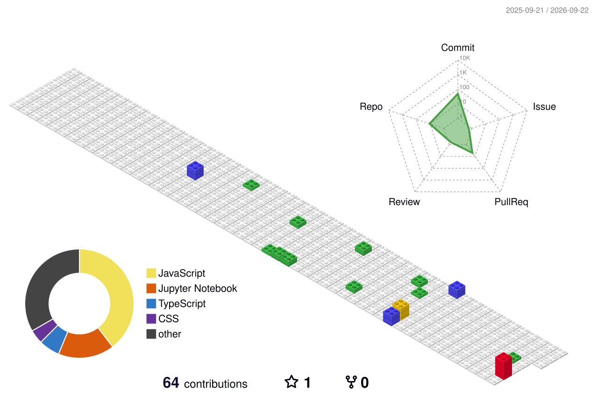
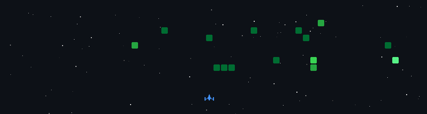

 

  
   
  

<h2 align="center" style="font-size: 1.65em; font-weight: 400; letter-spacing: -0.01em; line-height: 1.4; margin-top: 10px; margin-bottom: 20px;">
  Greetings From Ram's Domain 🪄 Building with Code & Intelligence!
</h2>

 

<h1 align="center">Hi There! &nbsp;&nbsp;&nbsp;I'm </h1>

<h3 align="center">

</h3>

<h3 align="center"><strong> MCA Student @ NIT Trichy | Full Stack & AI Developer from India  </strong> </h3>

  

> *"The secret of getting ahead is getting started."* — Mark Twain 🚀

- 🎓 **Master of Computer Applications (MCA)** at **National Institute of Technology, Tiruchirappalli (NIT Trichy)**
- 🔭 Currently working on **AI-Powered Code Review Bot & Full-Stack Applications**
- 🌱 Exploring **LLMs, Generative AI, LangChain, RAG, Redis & System Architecture**
- 💬 Ask me about **C++, Java, Python, JavaScript, React, Next.js, Node.js & DSA**
- 🏆 Ranked among the **Top 20% on LeetCode** globally
- 📫 Reach me @ **ram26102004@gmail.com**

 

  &nbsp;&nbsp;&nbsp;&nbsp;&nbsp;&nbsp;&nbsp;&nbsp;&nbsp;&nbsp;&nbsp;&nbsp;&nbsp;&nbsp;&nbsp;&nbsp;&nbsp;&nbsp;&nbsp;&nbsp;&nbsp;&nbsp;&nbsp;&nbsp;&nbsp;&nbsp;&nbsp;&nbsp;&nbsp;&nbsp;&nbsp;&nbsp;
  

<h2 align='center'><strong>Socials and Coding Profiles 💻</strong></h2>

 

  

<h2 align='center'><strong>Languages, Tools and Technologies 🚀 </strong></h2>
	 
<table>
	<tr>
		<td><strong>Programming Languages</strong></td>
		<td></td>
	</tr>
	<tr>
		<td><strong>Frontend Development</strong></td>
		<td></td>
	</tr>
	<tr>
		<td><strong>Backend Development</strong></td>
		<td></td>
	</tr>
	<tr>
		<td><strong>Database Technologies</strong></td>
		<td></td>
	</tr>
	<tr>
		<td><strong>AI / GenAI & Tools</strong></td>
		<td>   </td>
	</tr>
	<tr>
		<td><strong>Cloud & DevOps</strong></td>
		<td></td>
	</tr>
	<tr>
		<td><strong>Developer Tools</strong></td>
		<td></td>
	</tr>
	<tr>
		<td><strong>Operating Systems</strong></td>
		<td>
		 
		 
		</td>
	</tr>
</table>

  

<h3 align='center'><strong>Github Analytics ⚙️</strong></h3>

 

<table style="width: 100%; background-color: #1e1e1e; color: white; table-layout: fixed;">
  <thead>
    <tr>
      <th colspan="2" align="center">
        
      </th>
    </tr>
    <tr>
      <td align="center" style="padding: 15px;">
        
      </td>
      <td align="center" style="padding: 15px;">
        
      </td>
    </tr>
  </thead>
  <tbody>
    <tr>
      <td colspan="2" align="center" style="padding: 15px;">
        
      </td>
    </tr>
  </tbody>
</table>

